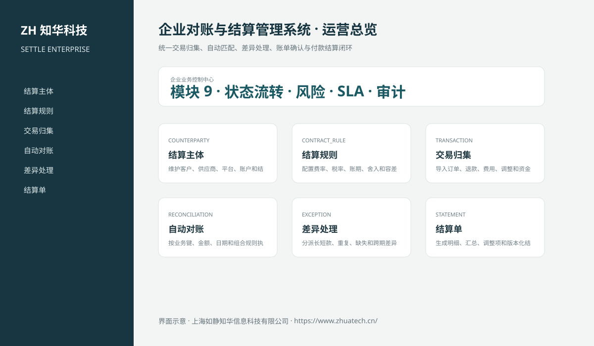

# ZhuaTech SETTLE｜企业对账与结算管理系统

> 统一交易归集、自动匹配、差异处理、账单确认与付款结算闭环

ZhuaTech SETTLE 是知华科技（上海如静知华信息科技有限公司）发布的企业级源码项目，面向“结算主体、合同规则、交易归集、自动对账、差异、账单、发票、付款和审计”提供管理端与响应式业务端。工程采用前后端分离架构，所有示例数据均为虚构数据。

[知华科技官网](https://www.zhuatech.cn/) · [架构说明](docs/ARCHITECTURE.md) · [API 文档](docs/API.md) · [企业能力](docs/ENTERPRISE.md) · [测试说明](docs/TESTING.md)



## 业务模块

| 模块 | 核心能力 |
| --- | --- |
| 结算主体 | 维护客户、供应商、平台、账户和结算周期 |
| 结算规则 | 配置费率、税率、账期、舍入和容差规则 |
| 交易归集 | 导入订单、退款、费用、调整和资金流水 |
| 自动对账 | 按业务键、金额、日期和组合规则执行匹配 |
| 差异处理 | 分派长短款、重复、缺失和跨期差异并复核 |
| 结算单 | 生成明细、汇总、调整项和版本化结算单 |
| 对方确认 | 支持线上确认、异议、证据和重开流程 |
| 开票付款 | 连接发票、付款计划、银行回单和核销结果 |
| 结算审计 | 保留导入批次、规则版本、差异和审批证据 |


## 专业业务深化

- 对账批次持久化业务源金额、账务金额、交易与匹配数量、未决差异和付款门禁；
- 自动对账按金额容差、匹配率和未决差异判断进入无差异或异常处理状态；
- 支持批量导入业务侧与账务侧逐笔流水，以外部流水号执行双边匹配、差额汇总和未匹配定位，并阻止重复导入；
- 异常批次仅管理员可复核调整，修改后重新计算金额差异和匹配率；
- 结算必须依次完成无差异对账、对方确认、发票齐备、账户验证和付款回执。

## 企业级控制

- ADMIN / OPERATOR 角色边界和管理员接口隔离；
- 服务端字段、模块、唯一编号和状态迁移校验；
- 组织、期间、责任人、风险等级、到期日和 SLA 统计；
- 支持组织/账期隔离查询、治理驾驶舱、办结率、证据缺口与同步失败监控；
- 支持最多 100 条控制项的原子批量提交、管理员批量复核和失败整体回滚；
- 支持组织账期锁定/解锁，锁定后禁止新增、提交、审批、补证和办结；
- 幂等创建、JPA 乐观锁、重复提交保护和职责分离；
- 附件 SHA-256 元数据、业务凭证完整性与全流程审计；
- 组合检索、分页、逾期筛选、UTF-8 CSV 导出和协作时间线；
- 外部系统仅预留适配器，使用方自行配置地址与凭据；
- prod profile 拒绝默认密码、弱数据库口令和本地跨域来源。

## 技术架构

- 后端：Java 21、Spring Boot、Spring Security、JPA、Bean Validation、Actuator
- 前端：Vue 3、Vite、Axios，支持桌面端与移动端响应式布局
- 数据库：MySQL 8；自动化测试使用 H2
- 交付：Docker Compose、Nginx、环境变量、GitHub Actions
- Java 包名：`cn.zhuatech.settlement`

## 启动与测试

```bash
cd backend && mvn test
cd ../frontend && npm install && npm run build
cd .. && cp .env.example .env && docker compose up --build
```

开发演示账号：`admin / admin123`、`operator / operator123`。生产环境必须通过环境变量替换全部默认凭据。

## 许可与商业授权

Copyright © 2026 上海如静知华信息科技有限公司。

本工程仅允许个人学习、研究和非商业技术交流，**不得用于商业用途**。企业内部使用、生产部署、SaaS运营、项目交付、品牌替换、收费培训、咨询实施或再分发，均须事先获得上海如静知华信息科技有限公司书面授权，详见 [LICENSE](LICENSE)。

深度开发、私有化部署、系统集成与企业数字化咨询，请访问[知华科技官网](https://www.zhuatech.cn/)或扫码联系：

| 微信咨询一 | 微信咨询二 |
| --- | --- |
|  |  |

SEO：企业对账与结算管理系统、SETTLE系统源码、企业数字化、Java企业系统、Vue管理系统、知华科技、上海如静知华信息科技有限公司。
